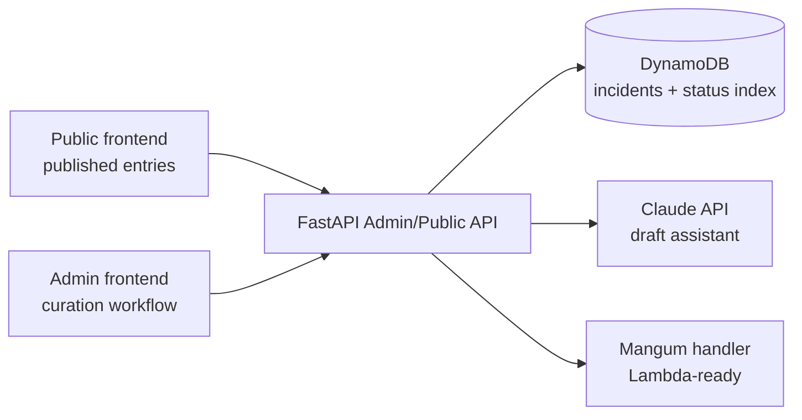

# Vide Verum

**A curated UAP / NHI incident encyclopedia with an editorial admin workflow.**

Vide Verum is a current portfolio build for exploring how historical cases, source material, credibility signals, and editorial review can be modeled as a searchable public database. The project includes a public reading experience, an admin API, and an AI-assisted drafting workflow that helps structure entries while preserving human review and source verification.

The project is intentionally opinionated: it does not present AI output as truth. The admin workflow stores draft status, source metadata, verification flags, curator notes, publishing state, credibility tiers, and documented criteria before an entry becomes public.

> **Status:** active build. Good concept and backend foundation; still needs production auth and a more complete deployment hardening pass before it should be treated as a polished public system.

---

## What it demonstrates

- **Domain modeling** — incidents include eras, source type, credibility score, evidence flags, source lists, related cases, themes, and editorial status.
- **API design** — FastAPI routes for incident CRUD, status transitions, published lookups, admin stats, and AI-assisted drafting.
- **Cloud-ready backend** — Mangum adapter prepares the FastAPI app for AWS Lambda/API Gateway deployment.
- **DynamoDB-backed content workflow** — incident records are stored by generated IDs and queried by publication/status indexes.
- **AI-assisted editorial operations** — Claude can draft a structured JSON entry, but the prompt requires attribution, verify flags, source URLs, and no speculation.
- **Portfolio transparency** — the repo now documents demo boundaries and what must be hardened before production.

---

## Architecture



## Stack

| Layer | Choice |
|---|---|
| Backend | FastAPI + Mangum |
| Runtime target | AWS Lambda/API Gateway pattern |
| Data | DynamoDB incident table + status/date index |
| AI assist | Anthropic Claude draft endpoint |
| Frontend | Public and admin frontend directories |
| Security posture | Environment-scoped CORS, admin token boundary, source verification flags, publish checks |

---

## Data model highlights

Each incident can include title, hook, date display, sortable date, date precision, location, country, coordinates, era, source type, narrative, curator notes, credibility score, tier, criteria met, themes, related incidents, physical evidence flags, source objects, AI drafting status, and verification flags.

This structure is meant to separate **documented facts**, **witness accounts**, **source metadata**, and **editorial review state**.

---

## Editorial safeguards

The AI drafting prompt is intentionally constrained:

- Attribute witness descriptions instead of stating them as fact.
- Avoid speculation about origin, meaning, or explanation.
- Return structured JSON only.
- Include source URLs when known with high confidence.
- Flag uncertain claims in `verify_flags`.
- Avoid dramatic language and unsupported conclusions.

Publishing also requires key editorial fields, including curator notes and a title, before an incident can move to `published`.

---

## Security and demo boundaries

Vide Verum is still an active build, so the README is explicit about what is demo-safe versus production-ready.

Current hardening goals:

- CORS should be restricted to known public/admin frontend origins through environment configuration.
- Admin write routes should require an admin token or real identity provider before public deployment.
- AI credentials should stay server-side only and be loaded from environment or a secrets manager/SSM parameter.
- DynamoDB IAM should be narrowed to the incident table and the exact read/write actions the API needs.
- Public routes should only expose entries with `status=published`.
- Admin routes should eventually move behind Cognito, WorkOS, Okta, or another real identity layer.

For portfolio purposes, keep this repo pinned only after these boundaries are visible in code and documentation.

---

## Local development

```bash
cd backend
python -m venv .venv
source .venv/bin/activate
pip install -r requirements.txt

export DYNAMO_TABLE=vv-incidents
export AWS_REGION=us-east-1
export CORS_ALLOWED_ORIGINS=http://localhost:5173,http://localhost:5174
export ADMIN_API_TOKEN=replace-with-a-local-dev-token
export ANTHROPIC_API_KEY=replace-with-your-local-key

uvicorn main:app --reload
```

Example admin request:

```bash
curl -H "X-Admin-Token: replace-with-a-local-dev-token" http://localhost:8000/stats
```

---

## Deployment notes

Before deploying publicly:

1. Create the DynamoDB table and `status-date-index` expected by the API.
2. Store the LLM credential outside source control.
3. Set `CORS_ALLOWED_ORIGINS` to the exact public/admin frontend origins.
4. Set `ADMIN_API_TOKEN` or replace it with real auth.
5. Ensure the Lambda role can only access the incident table and required index.
6. Confirm public UI calls only published entry endpoints.

---

## What I would change at production scale

- Split public and admin APIs into separate gateways or route groups.
- Add Cognito/WorkOS/Okta auth for admin access.
- Add per-entry audit history for editorial changes.
- Add OpenSearch or a DynamoDB search/indexing strategy for public discovery.
- Add source ingestion helpers with duplicate detection.
- Add CI for tests, linting, dependency scanning, and infrastructure validation.
- Add CloudWatch dashboards and alarms for API errors, latency, draft failures, and unusual admin activity.

---

## Repo layout

```text
backend/          FastAPI admin/public API and AI draft workflow
admin-frontend/   Editorial/admin interface
frontend/         Public reading experience
```
